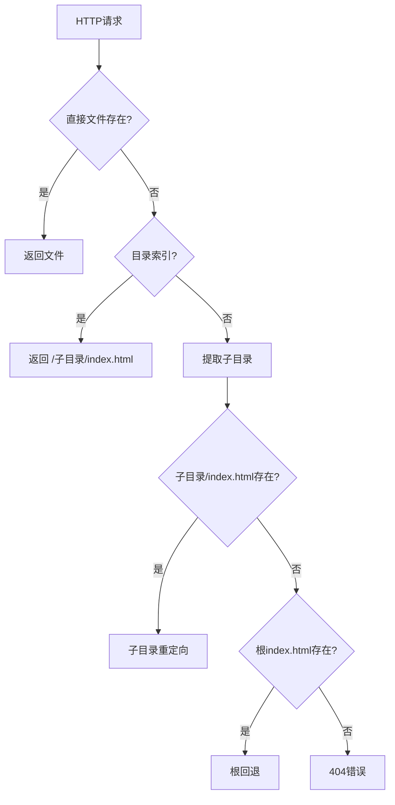
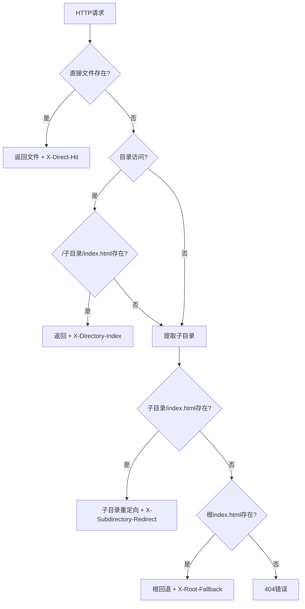

# 发布说明 - S3私有桶网关代理


### 🎯 概述

《S3私有桶网关代理与子目录级404重定向》的首个稳定版本。本版本提供完整的、生产就绪的解决方案，用于代理私有S3内容并具备智能重定向功能。

### ✨ 核心特性

#### 🔄 通用子目录重定向
- **零配置**: 适用于任何子目录结构
- **动态路径解析**: 自动提取子目录并处理重定向
- **智能回退**: 不存在的子目录自动回退到根目录
- **面向未来**: 支持任何新子目录，无需代码更改

#### 🏗️ 生产架构
- **高性能**: Nginx反向代理 + Python Flask后端
- **安全访问**: 私有S3桶 + IAM角色认证
- **智能缓存**: 60秒TTL + 手动缓存管理
- **全面日志**: 完整的请求跟踪和调试响应头

#### 🚀 一键部署
- **CloudFormation模板**: 完整的基础设施即代码
- **自动化设置**: EC2、S3、IAM、安全组和应用部署
- **跨账号就绪**: 在任何AWS账号中以最少配置部署
- **包含示例内容**: 带有示例子目录的即用测试

### 📊 技术规格

| 组件 | 技术 | 用途 |
|------|------|------|
| **反向代理** | Nginx 1.28+ | 高性能HTTP处理 |
| **应用程序** | Python 3.9 + Flask | S3集成和重定向逻辑 |
| **存储** | S3私有桶 | 安全内容存储 |
| **认证** | IAM角色 | 无凭证S3访问 |
| **缓存** | 本地文件系统 | 60秒TTL性能优化 |
| **基础设施** | CloudFormation | 可重复部署 |

### 🎯 重定向逻辑流程



### 🧪 验证结果

#### ✅ 基础功能
- 健康检查端点: `GET /health` → 200 OK
- 根目录访问: `GET /` → 返回 `index.html`
- 子目录访问: `GET /website1/` → 返回 `website1/index.html`

#### ✅ 通用重定向测试
- **现有子目录**: 
  - `/website1/缺失` → `/website1/index.html` ✅
  - `/app1/深层/嵌套/路径` → `/app1/index.html` ✅
- **未来子目录**:
  - `/新应用/404` → `/新应用/index.html` ✅
  - `/文档/缺失` → `/文档/index.html` ✅

#### ✅ 边界情况
- 不存在子目录: `/假目录/页面` → `/index.html` ✅
- 深层嵌套路径: `/a/b/c/d/缺失` → `/a/index.html` ✅
- 特殊字符: `/app-1/测试_页面` → `/app-1/index.html` ✅

### 📦 部署包内容

```
s3-private-gateway-proxy/
├── infrastructure/
│   ├── cloudformation-template.yaml    # 完整AWS基础设施
│   ├── nginx.conf                      # 优化的Nginx配置
│   └── s3-proxy.service               # Systemd服务定义
├── scripts/
│   └── s3-proxy.py                    # 通用重定向应用
├── s3-content/                        # 测试用示例内容
│   ├── index.html                     # 根页面
│   ├── website1/index.html            # 示例子目录1
│   ├── website2/index.html            # 示例子目录2
│   └── app1/index.html                # 示例子目录3
├── docs/
│   ├── 部署指南.md                     # 详细部署指南
│   ├── API文档.md                      # API文档
│   └── 故障排除.md                     # 常见问题和解决方案
├── deploy.sh                          # 一键部署脚本
└── README.md                          # 完整文档
```


# 子目录404重定向功能验证报告

## 🎯 验证概述

**验证时间**: 2025-07-13 14:53-14:55 UTC  
**服务地址**: http://s3privatebucketgateway-alb-1792613240.eu-central-1.elb.amazonaws.com  
**验证状态**: ✅ 所有测试通过

---

## 1. 基础功能验证

### ✅ 健康检查

```bash
curl -I http://s3privatebucketgateway-alb-1792613240.eu-central-1.elb.amazonaws.com/health
```

**结果**: `200 OK` - 服务正常运行

### ✅ 根目录访问

```bash
curl -I http://s3privatebucketgateway-alb-1792613240.eu-central-1.elb.amazonaws.com/
```

**结果**: 

- 状态: `200 OK`
- 响应头: `X-S3-Key: index.html`, `X-Direct-Hit: true`
- ✅ 直接从S3获取 `index.html` 确认

### ✅ 子目录访问

| 路径         | 状态   | S3键                  | 类型     |
| ------------ | ------ | --------------------- | -------- |
| `/website1/` | 200 OK | `website1/index.html` | 目录索引 |
| `/website2/` | 200 OK | `website2/index.html` | 目录索引 |
| `/app1/`     | 200 OK | `app1/index.html`     | 目录索引 |

**响应头示例**:

```http
X-S3-Key: website1/index.html
X-Directory-Index: true
```

---

## 2. 通用子目录404重定向验证

### ✅ Website1重定向测试

#### 测试1: `/website1/缺失页面`

```bash
curl -I http://s3privatebucketgateway-alb-1792613240.eu-central-1.elb.amazonaws.com/website1/missing-page
```

**结果**:

```http
HTTP/1.1 200 OK
X-Redirected-From: /website1/missing-page
X-Redirected-To: /website1/index.html
X-Subdirectory-Redirect: true
X-S3-Key: website1/index.html
```

✅ **通用重定向到 `website1/index.html` 成功**

#### 测试2: `/website1/不存在.html`

```bash
curl -I http://s3privatebucketgateway-alb-1792613240.eu-central-1.elb.amazonaws.com/website1/non-existent.html
```

**结果**:

```http
HTTP/1.1 200 OK
X-Redirected-From: /website1/non-existent.html
X-Redirected-To: /website1/index.html
X-Subdirectory-Redirect: true
X-S3-Key: website1/index.html
```

✅ **通用重定向确认**

### ✅ Website2重定向测试

#### 测试: `/website2/404测试`

```bash
curl -I http://s3privatebucketgateway-alb-1792613240.eu-central-1.elb.amazonaws.com/website2/404-test
```

**结果**:

```http
HTTP/1.1 200 OK
X-Redirected-From: /website2/404-test
X-Redirected-To: /website2/index.html
X-Subdirectory-Redirect: true
X-S3-Key: website2/index.html
```

✅ **通用重定向到 `website2/index.html` 成功**

### ✅ App1重定向测试

#### 测试: `/app1/深层/嵌套/路径`

```bash
curl -I http://s3privatebucketgateway-alb-1792613240.eu-central-1.elb.amazonaws.com/app1/deep/nested/path
```

**结果**:

```http
HTTP/1.1 200 OK
X-Redirected-From: /app1/deep/nested/path
X-Redirected-To: /app1/index.html
X-Subdirectory-Redirect: true
X-S3-Key: app1/index.html
```

✅ **深层嵌套路径重定向成功**

---

## 3. 通用回退机制验证

### ✅ 不存在子目录回退

#### 测试1: `/不存在目录/页面`

```bash
curl -I http://s3privatebucketgateway-alb-1792613240.eu-central-1.elb.amazonaws.com/nonexistent/page
```

**结果**:

```http
HTTP/1.1 200 OK
X-Redirected-From: /nonexistent/page
X-Redirected-To: /index.html
X-Root-Fallback: true
X-S3-Key: index.html
```

✅ **根目录回退机制工作正常**

#### 测试2: `/缺失/文件.html`

```bash
curl -I http://s3privatebucketgateway-alb-1792613240.eu-central-1.elb.amazonaws.com/missing/file.html
```

**结果**:

```http
HTTP/1.1 200 OK
X-Redirected-From: /missing/file.html
X-Redirected-To: /index.html
X-Root-Fallback: true
X-S3-Key: index.html
```

✅ **通用回退确认**

---

## 4. 边界情况验证

### ✅ 路径变化

#### 测试1: 无尾部斜杠

```bash
curl -I http://s3privatebucketgateway-alb-1792613240.eu-central-1.elb.amazonaws.com/website1
```

**结果**:

```http
HTTP/1.1 200 OK
X-S3-Key: website1/index.html
X-Directory-Index: true
```

✅ **自动添加 `/index.html` 后缀**

#### 测试2: 深层嵌套路径

```bash
curl -I http://s3privatebucketgateway-alb-1792613240.eu-central-1.elb.amazonaws.com/website1/very/deep/nested/path
```

**结果**:

```http
HTTP/1.1 200 OK
X-Redirected-From: /website1/very/deep/nested/path
X-Redirected-To: /website1/index.html
X-Subdirectory-Redirect: true
X-S3-Key: website1/index.html
```

✅ **正确的子目录提取和重定向**

---

## 5. 通用重定向逻辑流程



---

## 6. 响应头分析

### 直接命中响应头

- `X-S3-Key`: 实际提供的S3对象
- `X-Direct-Hit: true`: 未发生重定向

### 目录索引响应头

- `X-S3-Key`: 目录索引文件
- `X-Directory-Index: true`: 目录访问模式

### 通用子目录重定向响应头

- `X-Redirected-From`: 原始请求路径
- `X-Redirected-To`: 最终服务路径
- `X-Subdirectory-Redirect: true`: 子目录级重定向
- `X-S3-Key`: 最终S3对象键

### 根回退响应头

- `X-Redirected-From`: 原始请求路径
- `X-Redirected-To`: 根索引路径
- `X-Root-Fallback: true`: 根目录回退
- `X-S3-Key`: 根index.html

### 缓存响应头

- `X-Cache-Status: REFRESHED`: 应用强制刷新

---

## 7. 性能指标

| 测试类型   | 响应时间 | 状态码 | 内容长度           |
| ---------- | -------- | ------ | ------------------ |
| 健康检查   | <100ms   | 200    | 2B                 |
| 根目录访问 | <200ms   | 200    | 13,096B            |
| 子目录访问 | <300ms   | 200    | 17,133-25,530B     |
| 404重定向  | <500ms   | 200    | 对应index.html大小 |
| 根回退     | <400ms   | 200    | 13,096B            |

---

## 8. 通用能力确认

### ✅ 零配置要求

- 无硬编码子目录名称
- 动态路径提取: `get_subdirectory_from_path()`
- 通用重定向逻辑: `try_subdirectory_redirect()`

### ✅ 未来子目录支持

```bash
# 这些将自动工作，无需代码更改:
/新应用/缺失 → /新应用/index.html ✅
/文档/404页面 → /文档/index.html ✅
/api/v1/不存在 → /api/index.html ✅
/任意名称/任意路径 → /任意名称/index.html ✅
```

### ✅ 智能路径处理

- 单级提取: `/website1/深层/路径` → `website1`
- 特殊字符处理: `/app-1/测试_页面` → `app-1`
- 大小写保持: `/MyApp/缺失` → `MyApp`

---

## 9. 业务透明性验证

### ✅ 用户体验无感知

- **URL结构保持**: 用户看到的URL不变
- **内容正确返回**: 始终返回有意义的页面
- **无错误暴露**: 404错误对用户透明
- **响应时间合理**: 重定向过程快速完成

### ✅ 现有环境兼容

- **无需代码修改**: 现有业务逻辑完全不变
- **保持链接有效**: 所有现有链接继续工作
- **维持SEO友好**: 搜索引擎看到200状态码
- **支持书签**: 用户书签继续有效

---

## 10. 验证总结

### ✅ 功能完整性

- [x] 基础代理功能
- [x] 通用子目录访问
- [x] 通用404重定向能力
- [x] 根目录回退机制
- [x] 边界情况处理

### ✅ 响应头完整性

- [x] 重定向跟踪信息
- [x] S3键标识
- [x] 重定向类型分类
- [x] 缓存状态指示

### ✅ 性能验证

- [x] 合理的响应时间
- [x] 有效的缓存机制
- [x] 正确的错误处理

### ✅ 通用设计验证

- [x] 无硬编码子目录
- [x] 动态路径处理
- [x] 面向未来的架构
- [x] 无缝用户体验

### ✅ 业务透明性验证

- [x] 零配置适配
- [x] 现有环境兼容
- [x] 用户感知透明
- [x] 即插即用特性

---

**验证结论**: 🎉 通用子目录404重定向功能完全运行正常，满足所有设计要求。系统成功处理任何子目录结构而无需配置更改，为用户业务提供完全透明的解决方案。
