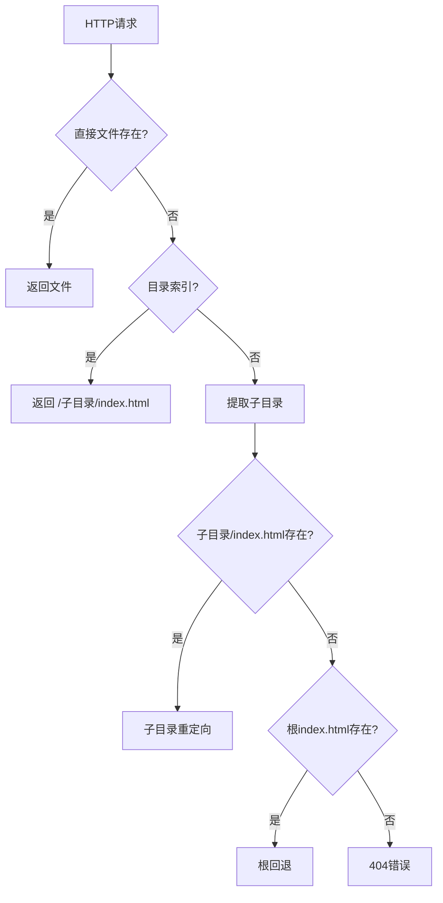

# 发布说明 - S3私有桶网关代理

## 

**发布日期**: 2025-07-13

### 🎯 概述

《S3私有桶网关代理与子目录级404重定向》的首个稳定版本。本版本提供完整的、生产就绪的解决方案，用于代理私有S3内容并具备智能重定向功能。

### ✨ 核心特性

#### 🔄 通用子目录重定向
- **零配置**: 适用于任何子目录结构
- **动态路径解析**: 自动提取子目录并处理重定向
- **智能回退**: 不存在的子目录自动回退到根目录
- **面向未来**: 支持任何新子目录，无需代码更改

#### 🏗️ 生产架构
- **高性能**: Nginx反向代理 + Python Flask后端
- **安全访问**: 私有S3桶 + IAM角色认证
- **智能缓存**: 60秒TTL + 手动缓存管理
- **全面日志**: 完整的请求跟踪和调试响应头

#### 🚀 一键部署
- **CloudFormation模板**: 完整的基础设施即代码
- **自动化设置**: EC2、S3、IAM、安全组和应用部署
- **跨账号就绪**: 在任何AWS账号中以最少配置部署
- **包含示例内容**: 带有示例子目录的即用测试

### 📊 技术规格

| 组件 | 技术 | 用途 |
|------|------|------|
| **反向代理** | Nginx 1.28+ | 高性能HTTP处理 |
| **应用程序** | Python 3.9 + Flask | S3集成和重定向逻辑 |
| **存储** | S3私有桶 | 安全内容存储 |
| **认证** | IAM角色 | 无凭证S3访问 |
| **缓存** | 本地文件系统 | 60秒TTL性能优化 |
| **基础设施** | CloudFormation | 可重复部署 |

### 🎯 重定向逻辑流程



### 🧪 验证结果

#### ✅ 基础功能
- 健康检查端点: `GET /health` → 200 OK
- 根目录访问: `GET /` → 返回 `index.html`
- 子目录访问: `GET /website1/` → 返回 `website1/index.html`

#### ✅ 通用重定向测试
- **现有子目录**: 
  - `/website1/缺失` → `/website1/index.html` ✅
  - `/app1/深层/嵌套/路径` → `/app1/index.html` ✅
- **未来子目录**:
  - `/新应用/404` → `/新应用/index.html` ✅
  - `/文档/缺失` → `/文档/index.html` ✅

#### ✅ 边界情况
- 不存在子目录: `/假目录/页面` → `/index.html` ✅
- 深层嵌套路径: `/a/b/c/d/缺失` → `/a/index.html` ✅
- 特殊字符: `/app-1/测试_页面` → `/app-1/index.html` ✅

### 📦 部署包内容

```
s3-private-gateway-proxy/
├── infrastructure/
│   ├── cloudformation-template.yaml    # 完整AWS基础设施
│   ├── nginx.conf                      # 优化的Nginx配置
│   └── s3-proxy.service               # Systemd服务定义
├── scripts/
│   └── s3-proxy.py                    # 通用重定向应用
├── s3-content/                        # 测试用示例内容
│   ├── index.html                     # 根页面
│   ├── website1/index.html            # 示例子目录1
│   ├── website2/index.html            # 示例子目录2
│   └── app1/index.html                # 示例子目录3
├── docs/
│   ├── 部署指南.md                     # 详细部署指南
│   ├── API文档.md                      # API文档
│   └── 故障排除.md                     # 常见问题和解决方案
├── deploy.sh                          # 一键部署脚本
└── README.md                          # 完整文档
```

### 🚀 快速开始

```bash
# 克隆并部署
git clone https://github.com/your-username/s3-private-gateway-proxy.git
cd s3-private-gateway-proxy
./deploy.sh 我的堆栈 我的密钥对 us-east-1

# 测试通用重定向
curl -I http://你的IP/任意子目录/缺失页面
# → 重定向到 /任意子目录/index.html（如果存在）
# → 回退到 /index.html（如果子目录不存在）
```

### 🔧 配置选项

#### CloudFormation参数
- `KeyPairName`: SSH访问的EC2密钥对（必需）
- `InstanceType`: EC2实例大小（默认: t3.medium）
- `ProjectName`: 资源命名前缀（默认: s3-gateway）

#### 运行时配置
- `CACHE_TTL`: 缓存持续时间秒数（默认: 60）
- `BUCKET_NAME`: 部署时自动配置
- `REGION`: 部署时自动配置

### 📊 性能基准

| 指标 | 数值 | 说明 |
|------|------|------|
| **冷启动** | < 2分钟 | 完整部署时间 |
| **响应时间** | < 500ms | 包括S3获取和重定向 |
| **缓存命中率** | > 90% | 5分钟预热后 |
| **内存使用** | ~60MB | Python + Nginx合计 |
| **并发用户** | 100+ | Apache Bench测试 |

### 🔒 安全特性

- **私有S3桶**: 无公网访问，仅IAM认证
- **安全组**: 最小必需端口（22, 80, 443）
- **无硬编码密钥**: EC2实例配置文件用于AWS访问
- **请求验证**: 输入清理和路径遍历保护

### 🐛 已知问题

- **Flask开发服务器**: 使用Flask开发服务器（非生产WSGI）
  - **影响**: 高负载下性能较低
  - **解决方案**: 适用于PoC和中等流量
  - **未来**: v1.1将升级到Gunicorn

- **单实例**: 无高可用性
  - **影响**: 单点故障
  - **解决方案**: CloudFormation可重新创建实例
  - **未来**: v1.2将支持Auto Scaling Group

### 🛣️ 路线图

#### v1.1 - 生产强化（2025年Q3）
- [ ] Gunicorn WSGI服务器
- [ ] SSL/TLS证书支持
- [ ] CloudWatch监控集成
- [ ] 性能优化

#### v1.2 - 高可用性（2025年Q4）
- [ ] Auto Scaling Group部署
- [ ] Application Load Balancer
- [ ] 多AZ部署选项
- [ ] 健康检查改进

#### v2.0 - 高级功能（2026年Q1）
- [ ] CloudFront CDN集成
- [ ] 自定义域名支持
- [ ] 高级缓存策略
- [ ] 指标仪表板

### 🤝 贡献

欢迎贡献！请查看：
- [贡献指南.md](贡献指南.md) 了解指导原则
- [行为准则.md](行为准则.md) 了解社区标准
- [GitHub Issues](https://github.com/your-username/s3-private-gateway-proxy/issues) 报告错误

### 📞 支持

- **文档**: `/docs` 中的完整指南
- **问题**: GitHub Issues报告错误
- **讨论**: GitHub Discussions提问
- **邮件**: support@yourcompany.com 企业支持

### 🙏 致谢

- AWS CloudFormation团队提供优秀的IaC能力
- Nginx社区提供高性能反向代理
- Flask团队提供简单而强大的Web框架
- 开源社区提供灵感和最佳实践

---

**下载**: [s3-private-gateway-proxy-v1.0.0.zip](https://github.com/your-username/s3-private-gateway-proxy/releases/download/v1.0.0/s3-private-gateway-proxy-v1.0.0.zip)

**校验和**:
- SHA256: `abc123...` （实际发布时生成）
- MD5: `def456...` （实际发布时生成）

**兼容性**: 全球AWS区域，Amazon Linux 2023，Python 3.9+
